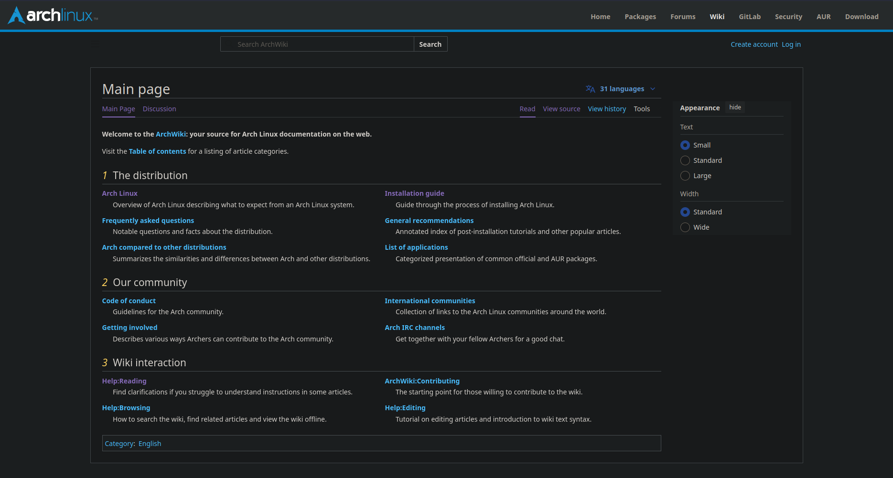
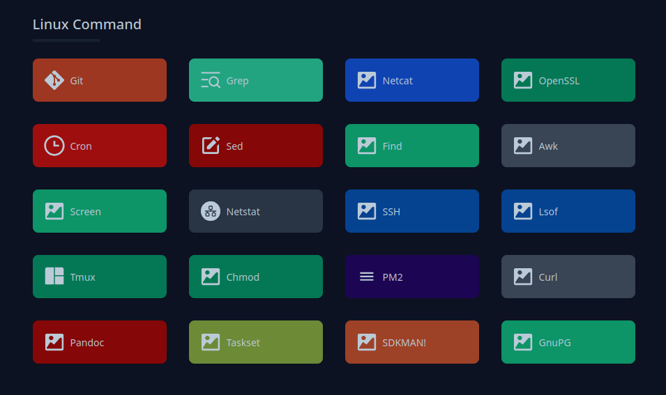
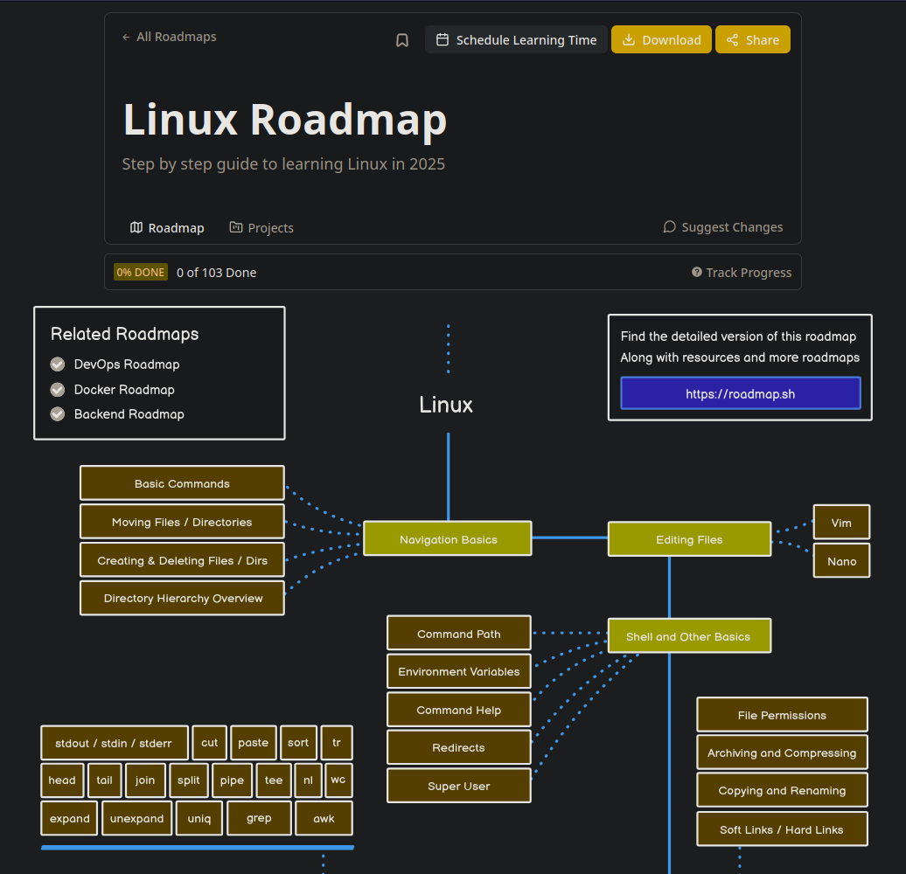
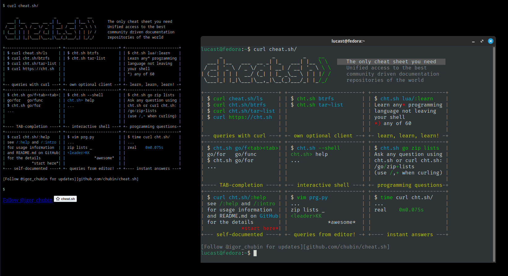
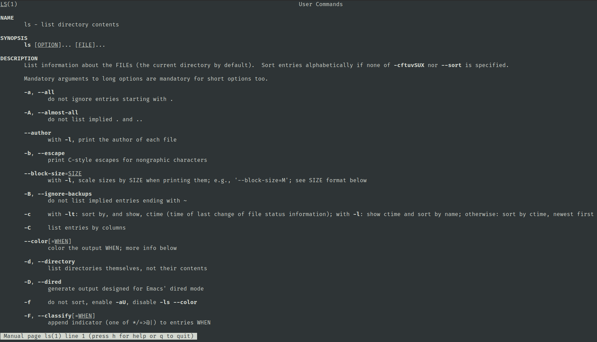
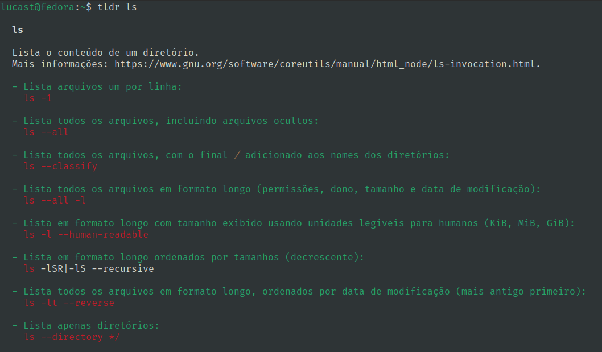

---
prev:
  text: "Meus Cursos"
  link: /pages/cursos/
next: false
---

# :penguin: Linux Desktop para Devs <Badge type="info"> <a href="./changelog">v0.1.0</a> </Badge>

Sejam todos muito bem vindos ao curso introdutório de Linux Desktop para Desenvolvedores! Nessa página vou comentar um pouco sobre cada módulo do curso e conforme o curso avança também serão armazenados aqui os materiais complementares. Sinta-se a vontade para explorar o conteúdo do curso.

## Módulo 0: Apresentação

### Conceito do curso:

O objetivo central do curso é que ao final você seja capaz de configurar, manusear e manter um ambiente de desenvolvimento utilizando um sistema operacional baseado no kernel Linux. Esse curso não é destinado a admnistração de servidores linux, mas sim de sistemas desktops com foco em desenvolvedores. Com isso, veremos como configurar ferramentas essenciais, gerenciar o sistema via linha de comando, personalização da área de trabalho e scripts em shellscript.

### Buscando novos conhecimentos:

Em nossa jornada vamos conhecer um pouco do universo Linux, mas não quero que você pare por aqui! Vamos abordar alguns locais onde você pode buscar conhecimento quando uma dúvida surgir.

#### [ArchWiki](https://wiki.archlinux.org/title/Main_page)

"Lucas, mas eu não uso Arch Linux", acalme-se! Apesar da ArchWiki ser feita pensada no Arch Linux, a base da maioria das distros linux é essencialmente a mesma. Portanto a maioria do conhecimento adquirido aqui pode ser usado e/ou adaptado para outras distros linux, e acredite, é muito conhecimento. A ArchWiki é uma documentação maravilhosa tanto para novatos, quanto para quem é experiente.

#### [CheatSheets](https://cheatsheets.zip/)

Apesar de não ser um site diretamente feito para o linux, sua utilidade é inegável. Com uma sessão exclusiva para comandos linux, o cheatsheets é um conjunto de "dicas rápidas", para quem esqueceu aquele comando específico e como ele funciona. Aqui, o foco não é aprender algo do zero, mas sim relembrar comandos que você já conhece.

#### [Roadmap.sh](https://roadmap.sh/linux)

Mas e quem terminou o curso e não sabe o que estudar em seguida? No Roadmap.sh, é encaminhado um roteiro de estudos sobre Linux para que você saiba como prosseguir seus estudos. Esse roteiro serve como base para que você não pule etapas ou fique perdido em qual conteúdo estudar primeiro. Apesar disso, nem todo conteúdo do roteiro é totalmente necessário para utilizar o sistema desktop. A maioria dos usuários vai conseguir se virar bem com apenas uma parcela desse roteiro.

#### [Cheat.sh](https://cheat.sh/)

Semelhante ao CheatSheets, mas com propósito diferente. O Cheat.sh tem uma interface minimalista proposital, já que o intuito é que você acesse o conteúdo do site através do terminal. Utilizando a ferramenta Curl, abordada no curso, é possível acessar facilmente o conteúdo do site através do terminal. Com isso, você tem as dicas rápidas e práticas que já tinha no cheatsheets, mas sem precisar abrir o navegador de internet pra isso. Você pode testar agora com o comando `curl cheat.sh/`.

#### [Comando Man](https://cheat.sh/man)

O comando `man` é descrito por si mesmo como "uma interface para os manuais de referência do sistema". De maneira semelhante ao que faz o Cheat.sh, mas com um conteúdo bem mais detalhado e técnico, o comando man busca manuais de outros comandos linux através do terminal. É um comando essencial para quem usa linux e é possível aprender muito sobre um comando apenas consultando seu "manual".

#### [Comando TLDR](https://tldr.sh/)

O TLDR (ou too long; didn't read), poderia ser descrito superficialmente como um resumo do comando `man`. Enquanto o comando `man` é o mais detalhado possível, o TLDR tenta focar no básico de como utilizar determinada ferramenta. Caso esteja se perguntando onde foi que viu isso antes, o Cheat.sh costuma trazer também o resultado do TLDR em sua busca. Muito provavelmente será necessário [instalar o TLDR](https://tldr.sh/#installation), pois não é um utilitário que costuma vir por padrão na maioria das distros linux.

<!-- ## Módulo 1: Introdução ao Sistema
## Módulo 2: Instalação do Linux
## Módulo 3: Interface Gráfica do Usuário (GUI)
## Módulo 4: Terminal e Comandos Básicos
## Módulo 5: Gerenciamento de Pacotes
## Módulo 6: Configuração do Ambiente de Desenvolvimento
## Módulo 7: Scripting e Automação -->